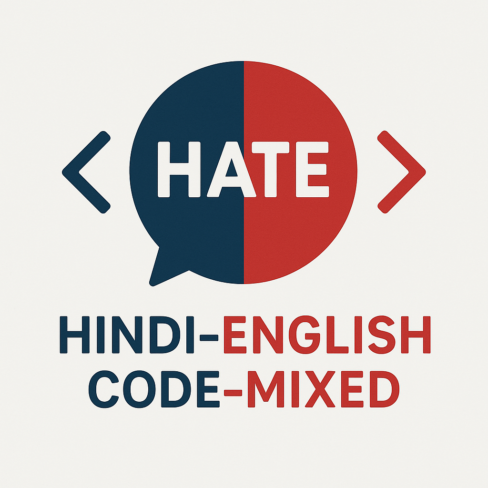

# Code-Mixed Hate Detection [ACM TALLIP 2025] 

<p align="center">
  
</p>

<div align="center">
  <a href="https://dl.acm.org/doi/abs/10.1145/3726866">
    
  </a>
  <a href="https://www.python.org/">
    
  </a>
  <a href="https://huggingface.co/">
    
  </a>
</div>


## 📌 Table of Contents
- [Prerequisites](#-prerequisites)
- [Datasets](#-datasets)
- [Getting Started](#-getting-started)
- [Experiments](#-experiments)
  - [Experiment 1](#experiment-1)
  - [Experiment 2](#experiment-2)
  - [Experiment 3](#experiment-3)
- [Citation](#-citation)

---

## 📖 Project Overview
This repository accompanies our ACM TALLIP 2025 paper on **Improving Code-Mixed Hate Detection by Native Sample Mixing**. We propose a novel method to enhance hate detection in Hindi-English code-mixed settings using native language samples and perform extensive experiments to validate our hypothesis.

---

## 📋 Prerequisites

1. Install all necessary dependencies with:
```bash
pip install -r requirements.txt
```
## 📂 Datasets

We used publicly available datasets across Hindi, English, and Hindi-English code-mixed domains:

| Dataset      | Language      | Source                                      |
|--------------|---------------|---------------------------------------------|
| Hate Codemix | Hindi-English | [Link](https://github.com/deepanshu1995/HateSpeech-Hindi-English-Code-Mixed-Social-Media-Text) |
| HASOC 2019 | English       | [Link](https://hasocfire.github.io/hasoc/2019/dataset.html) |
| HateCheckHIn   | Hindi         | [Link](https://github.com/hate-alert/HateCheckHIn)          |


## 🚀 Getting Started
To run a model on the code-mixed dataset (Hatespeech_Codemix):
```bash
python3 Main_results/{model}.py
```
Replace `{model}` with the specific model file.

## 🔬 Experiments

### Experiment 1
- Equal number of hate and non-hate samples (1416 each) from English and Hindi datasets were combined with the code-mixed data.
- A second variant uses native samples in the same ratio as the code-mixed training set.

Run using:
```
python3 Main_results/{model}.py
```

### Experiment 2
**1. Incremental Mixing:**
- Native samples were added in increments of 200 up to 1400.
- Default setup uses 200 samples.

**2. Label Ratio Mixing:**
- Native samples were added while maintaining class balance to match the ratio in the code-mixed training set.

Run using:
```
python3 Experiment2/{model}.py
```

These codes are default for 200 samples of Hindi and English dataset. For different
sample sizes required lines are commented in the code.


### Experiment 3
Native-only training with a code-mixed validation set. Three training sets:

**1.** With only Hindi samples

**2.** With only English samples

**3.** With English and Hindi samples together

All the training sets with an equal proportion of "hate" and "non-hate" samples.

Run using:
```
python3 Experiment3/{model}.py
```

## 📁 Directory Structure

```
├── Dataset/
│   ├── README.md
│   ├── hate_codemix
│   ├── hate_english
│   ├── hate_hindi
├── Experiment2/
│   ├── 0XLMR_Trans_Combined_exp2_200.py
│   ├── 0XLMR_Trans_Combined_exp2_cmratio.py
│   └── ...
├── Experiment3/
│   ├── 0XLMR_Trans_Combined_exp3_vcod.py
│   ├── 0XLMR_Trans_Combined_exp3_vcom.py
│   └── ...
├── Main_results/
│   ├── 0NB_Codemix.py
│   ├── 0NB_Combined_1416.py
│   └── ...
├── README.md
├── hate_logo.png
├── requirements.txt
```


## 📜 Citation
If you use our work, consider starring this repository and please cite it as:

```
@article{10.1145/3726866,
author = {Mazumder, Debajyoti and Kumar, Aakash and Patro, Jasabanta},
title = {Improving Code-Mixed Hate Detection by Native Sample Mixing: A Case Study for Hindi-English Code-Mixed Scenario},
year = {2025},
publisher = {Association for Computing Machinery},
address = {New York, NY, USA},
issn = {2375-4699},
url = {https://doi.org/10.1145/3726866},
doi = {10.1145/3726866},
abstract = {Hate detection has long been a challenging task for the NLP community. The task becomes complex in a code-mixed environment because the models must understand the context and the hate expressed through language alteration. Compared to the monolingual setup, we see much less work on code-mixed hate as large-scale annotated hate corpora are unavailable for the study. To overcome this bottleneck, we propose using native language hate samples (native language samples/ native samples hereafter). We hypothesise that in the era of multilingual language models (MLMs), hate in code-mixed settings can be detected by majorly relying on the native language samples. Even though the NLP literature reports the effectiveness of MLMs on hate detection in many cross-lingual settings, their extensive evaluation in a code-mixed scenario is yet to be done. This paper attempts to fill this gap through rigorous empirical experiments. We considered the Hindi-English code-mixed setup as a case study as we have the linguistic expertise for the same. Some of the interesting observations we got are: (i) adding native hate samples in the code-mixed training set, even in small quantity, improved the performance of MLMs for code-mixed hate detection, (ii) MLMs trained with native samples alone observed to be detecting code-mixed hate to a large extent, (iii) the visualisation of attention scores revealed that, when native samples were included in training, MLMs could better focus on the hate emitting words in the code-mixed context, and (iv) finally, when hate is subjective or sarcastic, naively mixing native samples doesn’t help much to detect code-mixed hate. We have released the data and code repository to reproduce the reported results.},
note = {Just Accepted},
journal = {ACM Trans. Asian Low-Resour. Lang. Inf. Process.},
month = mar,
keywords = {Code-mixed hate detection, Cross-lingual learning, Native sample mixing.}
}
```
